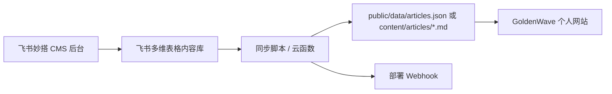
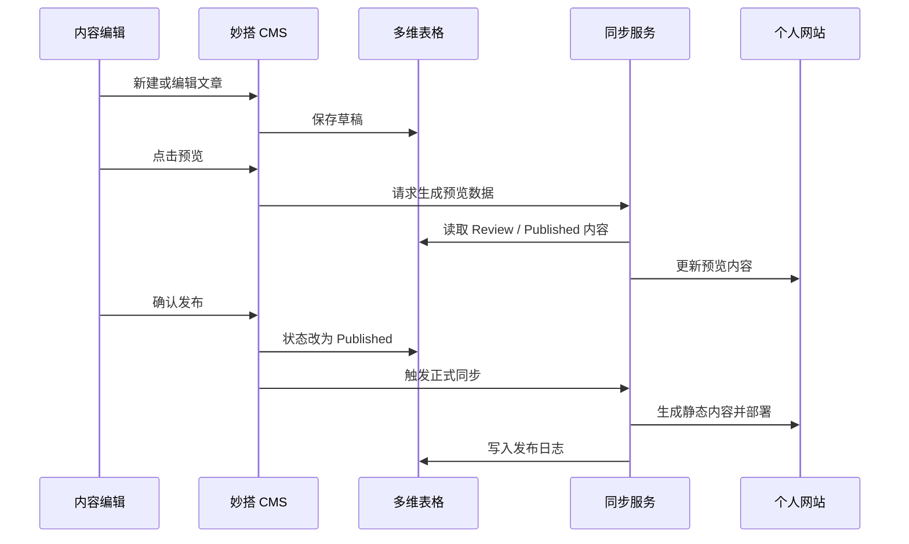

# GoldenWave 个人网站内容 CMS 后台需求与技术方案

版本：2026-06-11  
适用对象：飞书妙搭 / 飞书多维表格 / 个人网站内容更新后台

## 1. 目标

为 GoldenWave Asia 个人网站搭建一个轻量 CMS 后台，让我可以在飞书内维护个人文章、知识专题、外部链接和发布状态，并同步到当前个人网站的知识分享页面。

推荐定位：

- 飞书妙搭：内部内容管理后台与发布工作台。
- 飞书多维表格：结构化内容数据库。
- 当前个人网站：公开展示前台，继续保持独立部署和品牌视觉。
- 同步层：把飞书内容导出为 `JSON` 或 `Markdown`，触发网站重新部署。

不建议直接用妙搭替代当前个人网站前台。当前网站有强个人视觉、动效和品牌资产，妙搭更适合承担后台管理、数据录入、审核发布和自动化触发。

## 2. 业务范围

一期只做文章内容管理，保证能稳定更新网站里的知识分享文章。

一期包含：

- 文章创建、编辑、预览、发布、下线。
- 文章分类、标签、摘要、封面、推荐位管理。
- 首页 / 知识分享页可读取已发布文章。
- 支持草稿、待审核、已发布、已归档状态。
- 支持发布后触发网站内容同步。

二期可以扩展：

- 知识专题页。
- 个人知识地图节点管理。
- Newsletter / 订阅。
- 搜索、归档、时间线。
- 自动从个人知识库生成草稿。

## 3. 内容模型

### 3.1 文章表：Articles

字段建议：

| 字段 | 类型 | 必填 | 说明 |
| --- | --- | --- | --- |
| `title` | 单行文本 | 是 | 文章标题 |
| `slug` | 单行文本 | 是 | URL 标识，如 `agent-workflow-structure` |
| `subtitle` | 单行文本 | 否 | 副标题 |
| `summary` | 多行文本 | 是 | 文章卡片摘要，80-160 字 |
| `content` | 富文本 / Markdown | 是 | 正文内容 |
| `category` | 单选 | 是 | `AI Product` / `Agent Workflow` / `Knowledge System` / `AIGC` |
| `tags` | 多选 | 否 | 关键词 |
| `cover` | 附件 / URL | 否 | 封面图 |
| `status` | 单选 | 是 | `Draft` / `Review` / `Published` / `Archived` |
| `featured` | 复选框 | 否 | 是否推荐 |
| `publishedAt` | 日期时间 | 否 | 发布时间 |
| `updatedAt` | 日期时间 | 是 | 更新时间 |
| `seoTitle` | 单行文本 | 否 | SEO 标题 |
| `seoDescription` | 多行文本 | 否 | SEO 描述 |
| `sourceNote` | URL / 文本 | 否 | 来自哪个知识库笔记 |

### 3.2 分类表：Categories

字段建议：

| 字段 | 类型 | 说明 |
| --- | --- | --- |
| `name` | 单行文本 | 分类名称 |
| `slug` | 单行文本 | 分类标识 |
| `description` | 多行文本 | 分类说明 |
| `sort` | 数字 | 前台排序 |
| `visible` | 复选框 | 是否展示 |

### 3.3 同步日志表：Publish Logs

字段建议：

| 字段 | 类型 | 说明 |
| --- | --- | --- |
| `triggeredAt` | 日期时间 | 触发时间 |
| `operator` | 人员 | 操作人 |
| `target` | 单选 | `Preview` / `Production` |
| `status` | 单选 | `Pending` / `Success` / `Failed` |
| `message` | 多行文本 | 错误或结果说明 |
| `deployUrl` | URL | 部署结果地址 |

## 4. 妙搭后台页面

### 4.1 Dashboard

展示：

- 已发布文章数量。
- 草稿数量。
- 待审核数量。
- 最近更新时间。
- 最近一次同步状态。
- 快捷按钮：新建文章、同步预览、发布生产。

### 4.2 文章列表

能力：

- 按状态、分类、标签、是否推荐筛选。
- 按更新时间、发布时间排序。
- 快速切换状态：草稿、待审核、发布、归档。
- 显示标题、分类、摘要、发布时间、更新人。
- 操作：编辑、预览、复制链接、归档。

### 4.3 文章编辑

表单区：

- 标题、slug、分类、标签、摘要、封面、正文。
- SEO 标题、SEO 描述。
- 推荐开关。

校验规则：

- `title` 不能为空。
- `slug` 只能包含小写英文、数字和连字符。
- `slug` 不允许重复。
- 发布前必须填写 `summary`、`category`、`content`。
- `Published` 状态必须有 `publishedAt`。

### 4.4 预览与发布

预览：

- 调用同步接口生成预览数据。
- 返回预览地址。
- 不影响正式站点。

发布：

- 仅同步 `status = Published` 的文章。
- 触发网站部署。
- 写入发布日志。

## 5. 与当前个人网站的对接方案

### 5.1 推荐架构



### 5.2 一期实现方式

当前网站已经是静态前台，可以先使用最简单稳定的方式：

1. 妙搭后台维护文章。
2. 飞书多维表格保存文章结构化数据。
3. 同步脚本读取 `Published` 文章。
4. 生成 `public/data/articles.json`。
5. 网站文章页读取 JSON 渲染列表。
6. 触发 Cloudflare Pages / Vercel / Netlify 重新部署。

如果继续保持纯静态，也可以生成：

- `knowledge.html`：文章列表页。
- `articles/{slug}.html`：文章详情页。

### 5.3 二期实现方式

当文章数量变多后，建议迁移为 Astro：

- `content/articles/*.md` 管理文章。
- 构建时生成静态文章页。
- 保留当前视觉和动效资产。
- 妙搭 / 多维表格只做内容后台，不介入前台页面结构。

## 6. 同步接口建议

### 6.1 从飞书读取

使用飞书开放平台的多维表格 API：

- 查询记录：读取文章表。
- 查询字段：读取字段配置。
- 附件字段：读取封面资源。
- 权限：后台服务使用自建应用凭证。

### 6.2 同步输出 JSON 示例

```json
{
  "articles": [
    {
      "title": "AI 产品经理的新核心能力：把判断力编排成可验证闭环",
      "slug": "ai-pm-verifiable-loop",
      "summary": "当 AI 从演示走向业务系统，产品经理的价值不再只是写需求。",
      "category": "AI Product",
      "tags": ["AI Agent", "Product", "Workflow"],
      "featured": true,
      "publishedAt": "2026-06-11T10:00:00+08:00",
      "updatedAt": "2026-06-11T10:00:00+08:00"
    }
  ]
}
```

### 6.3 发布触发

发布按钮触发后：

1. 妙搭调用同步接口。
2. 同步接口校验内容。
3. 生成 JSON / Markdown。
4. 提交到 Git 仓库或写入对象存储。
5. 调用部署平台 Webhook。
6. 回写 `Publish Logs`。

## 7. 权限设计

一期可以简单设置：

- Owner：我本人，拥有所有权限。
- Editor：可创建和编辑草稿。
- Reviewer：可审核并切换为 Published。
- Viewer：只读。

如果只有我自己使用，可以先只做 Owner 权限，但数据表仍保留 `operator` 和日志，方便后续扩展。

## 8. 发布流程



## 9. 妙搭生成提示词

可以把下面这段直接给妙搭：

> 请为我的个人网站 GoldenWave Asia 生成一个内容 CMS 后台。后台用于管理知识分享文章，数据源使用飞书多维表格。需要包含 Dashboard、文章列表、文章编辑、预览发布、发布日志页面。文章字段包括 title、slug、subtitle、summary、content、category、tags、cover、status、featured、publishedAt、updatedAt、seoTitle、seoDescription、sourceNote。发布状态包括 Draft、Review、Published、Archived。发布时只同步 Published 文章，并调用外部 Webhook 触发我的个人网站部署。整体界面风格要克制、专业、偏内容工作台，不要做成营销网站。

## 10. 官方资料参考

- [飞书妙搭官网](https://miaoda.feishu.cn/)
- [飞书多维表格 Base API 概览](https://open.feishu.cn/document/server-docs/docs/bitable-v1/bitable-overview?lang=zh-CN)
- [飞书多维表格查询记录 API](https://open.feishu.cn/document/docs/bitable-v1/app-table-record/search?lang=zh-CN)

